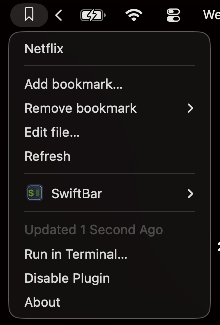
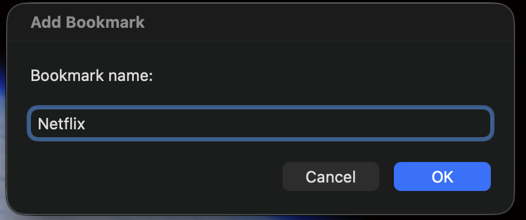
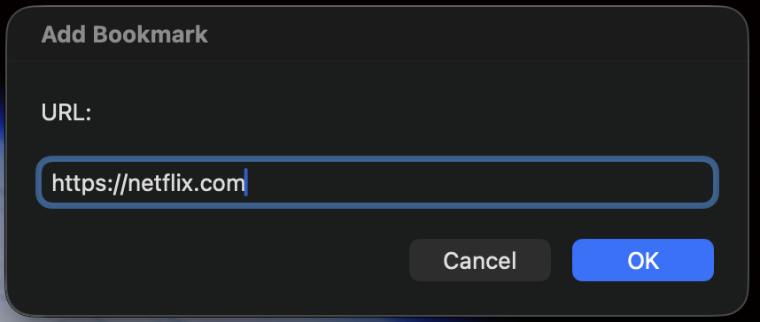
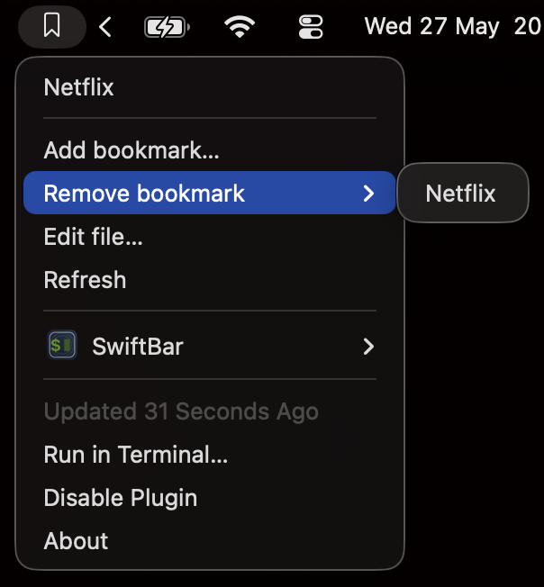

# SwiftBar Bookmarks Plugin

A tiny [SwiftBar](https://github.com/swiftbar/SwiftBar) plugin that puts your favourite URLs one click away in the macOS menubar.

<p align="center">
  
</p>

## Features

- Click any bookmark to open it in your default browser.
- Add new bookmarks via a native prompt (name + URL).
- Remove bookmarks from a submenu.
- Plain-text storage, easy to hand-edit.

## Install

1. Install [SwiftBar](https://github.com/swiftbar/SwiftBar).
2. Clone this repo somewhere:
   ```
   git clone git@github.com:ZukkyBaig/swiftbar-bookmark-plugin.git
   ```
3. In SwiftBar, set the plugin folder to `swiftbar-bookmark-plugin/plugins`.
4. The bookmark icon appears in your menubar.

## Usage

### Add a bookmark

Click **Add bookmark...** and fill in the prompts.

<p align="center">
  
  
</p>

If you omit `https://`, it is added for you.

### Open a bookmark

Click its name in the dropdown.

### Remove a bookmark

Hover over **Remove bookmark** and click the entry to delete.

<p align="center">
  
</p>

### Edit manually

Click **Edit file...** to open the storage file in your default editor.

## Storage

Bookmarks live in `~/.xbar-bookmarks.txt`, one per line:

```
Netflix | https://www.netflix.com/
GitHub | https://github.com/
```

## License

MIT
